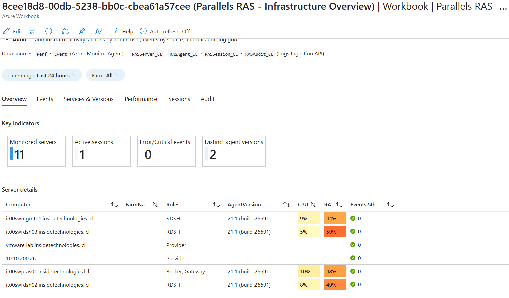

# Azure Workbook — Parallels RAS

Designed and developed by **Silvio Di Benedetto**, CEO at Inside Technologies, Microsoft MVP and Parallels VIPP.
Blog: https://www.silviodibenedetto.com

IaC package + collector to monitor a **Parallels Remote Application Server** (20.x → 21.x) farm in
**Azure Monitor / Log Analytics**, with a **six-tab Azure Workbook**.

Scenario: on-premises servers onboarded to **Azure Arc** (AMA 1.42+ included by default).

---



## Architecture

Data arrives from **two distinct pipelines**:

```
                       ┌──────────────────────────────────────────┐
                       │   Log Analytics Workspace                │
                       │   service-loganalytics-parallels         │
                       │   westeurope                             │
                       └──────────────────────────────────────────┘
                            ▲                         ▲
       Windows telemetry    │                         │  RAS-specific data
       (Perf + Event)       │                         │  (custom tables _CL)
                            │                         │
  ┌─────────────────────────┴──────┐    ┌─────────────┴────────────────────────┐
  │  Azure Monitor Agent (AMA)      │    │  Collect-RasInventory.ps1             │
  │  dcr-ras-prod-weu-ama           │    │  scheduled task every 5 min           │
  │  • performanceCounters → Perf   │    │  on the Connection Broker host         │
  │  • windowsEventLogs    → Event  │    │                                       │
  │                                 │    │  RAS PowerShell API:                   │
  │  Associated to Arc servers      │    │   Get-RASAgent / Get-RASRDSession /   │
  │                                 │    │   Get-RASAdminSession / ...           │
  └─────────────────────────────────┘    │      ▼                                │
                                         │  Logs Ingestion API (DCE + DCR)       │
                                         │   dce-ras-prod-weu                    │
                                         │   dcr-ras-prod-weu-ingest             │
                                         │   → RASServer_CL / RASAgent_CL /      │
                                         │     RASSession_CL / RASAudit_CL       │
                                         └───────────────────────────────────────┘
```

### Pipeline A — Windows telemetry (AMA + DCR)

DCR `kind: Windows` (`dcr-ras-prod-weu-ama`) collects performance counters and Event Log
and sends them to the native tables `Perf` and `Event`.
The DCR is associated to each Arc server. AMA 1.42+ is already included with Arc and
requires no separate installation.

> Role separation in the Workbook (Performance tab) is done via a
> **KQL join** between `Perf` and `RASServer_CL` on the computer name.

### Pipeline B — RAS-specific data (PowerShell + Logs Ingestion API)

The script runs on the **Connection Broker** host (the machine with RAS Console installed)
and queries the entire farm via the RAS API. It sends the JSON payload to the Logs Ingestion
API through `dce-ras-prod-weu` into 4 custom tables:

| Table           | RAS cmdlet source                                                 | Content                          |
|-----------------|-------------------------------------------------------------------|----------------------------------|
| `RASServer_CL`  | `Get-RASAgent` → Server, ServerType, AgentState, AgentVer, ServerOS, SiteId | Farm server inventory + role |
| `RASAgent_CL`   | `Get-RASAgent` → AgentVer, AgentState, ServerOS                   | Agent versions (physical objects only) |
| `RASSession_CL` | `Get-RASRDSession -Source All`                                    | Active RDP sessions              |
| `RASAudit_CL`   | `Get-RASAdminSession` + `Get-RASAdminAccount`                     | RAS admin sessions               |

**Logical objects note**: `Get-RASAgent` also returns logical objects (`RDSGroup`,
`VDITemplate`, `VDIHostPool`) which have no physical agent. The collector filters them
by type; KQL queries in the Workbook also exclude them for any already-ingested historical data.

### Authentication — two levels

1. **Toward Azure** (Logs Ingestion API) → **Managed Identity** of the collector host (Arc).
   Token obtained from the local `IDENTITY_ENDPOINT` (`localhost:40342`).
   The MI has the *Monitoring Metrics Publisher* role on the DCR-Ingest (assigned via Bicep).

2. **Toward the RAS farm** (`New-RASSession`) → username/password read from **Azure Key Vault**
   using the same MI (*Key Vault Secrets User* role).
   No credentials stored in plain text in scripts or Task Scheduler.

---

## Resources created by the deploy

All resources are created in a single resource group (configurable), region `westeurope`.

| Resource | Type | Notes |
| --- | --- | --- |
| `service-loganalytics-parallels` | Log Analytics Workspace | Dedicated, configurable retention |
| `dce-ras-prod-weu` | Data Collection Endpoint | Logs Ingestion API endpoint |
| `dcr-ras-prod-weu-ingest` | Data Collection Rule (Ingest) | Pipeline B → _CL tables |
| `dcr-ras-prod-weu-ama` | Data Collection Rule (AMA) | Pipeline A → Perf, Event |
| `kv-ras-prod-weu` | Key Vault (RBAC mode) | RAS secrets (ras-admin-user, ras-admin-password) |
| `RASServer_CL` … `RASAudit_CL` | Custom Log tables | 4 tables in the workspace |
| Parallels RAS Workbook | Microsoft.Insights/workbooks | 6 tabs: Overview → Audit |
| DCR association × servers | Association on Arc machines | One per server listed in `machines` |
| Role assignments × MI | Monitoring Metrics Publisher + KV User | On the collector host MI |

---

## Prerequisites

- **Azure CLI** with **Bicep** installed (`az bicep install`).
- RAS servers onboarded to **Azure Arc** with **system-assigned managed identity** enabled.
  AMA 1.42+ is pre-installed by default on Arc; no separate installation needed.
- On the collector host (Connection Broker): **RASAdmin PowerShell module** (included with RAS Console).
- A RAS service account with the **RAS Administrator** role (required by `Get-RASAdminSession`
  and `Get-RASAdminAccount`; custom/read-only roles are not sufficient).
- The user running the deploy must have **Contributor** on the resource group and
  **Key Vault Secrets Officer** on the vault (or create the secrets manually after deploy).
- Verify built-in role GUIDs in your subscription (they may differ between Azure Commercial / Government):
  ```powershell
  az role definition list --name "Key Vault Secrets User" `
    --subscription $(az account show --query id -o tsv) --query "[].name" -o tsv
  # expected: 4633458b-17de-408a-b874-0445c86b69e6

  az role definition list --name "Monitoring Metrics Publisher" `
    --subscription $(az account show --query id -o tsv) --query "[].name" -o tsv
  # expected: 3913510d-42f4-4e42-8a64-420c390055eb
  ```
  If they differ, update `bicep/modules/keyvault.bicep` and `bicep/modules/rbac.bicep`.

---

## Before you deploy — configure the parameters file

> `bicep/main.parameters.json` is excluded from git (`.gitignore`).
> Copy the example file and fill in your values before running the deploy.

```powershell
Copy-Item bicep\main.parameters.example.json bicep\main.parameters.json
```

Then edit `bicep/main.parameters.json` and replace every `<PLACEHOLDER>`:

| Parameter | Description | Example |
| --- | --- | --- |
| `location` | Azure region for all resources | `westeurope` |
| `workload` | Short workload label (used in resource names) | `ras` |
| `environment` | Environment tag (`prod`, `dev`, …) | `prod` |
| `regionCode` | 3-letter region code (used in resource names) | `weu` |
| `workspaceName` | Log Analytics workspace name | `service-loganalytics-parallels` |
| `retentionInDays` | Log retention in the workspace (days) | `30` |
| `samplingFrequencyInSeconds` | Perf counter sampling interval | `60` |
| `keyVaultName` | Key Vault name (globally unique) | `kv-ras-prod-weu` |
| `machines[].name` | Arc machine hostname (short name, no FQDN) | `MYSERVER01` |
| `machines[].subscriptionId` | Azure subscription ID of each Arc machine | `xxxxxxxx-xxxx-xxxx-xxxx-xxxxxxxxxxxx` |
| `machines[].resourceGroup` | Resource group where the Arc machine lives | `rg-arc-servers` |
| `collectorPrincipalIds` | Object ID of the collector host Managed Identity | `xxxxxxxx-xxxx-xxxx-xxxx-xxxxxxxxxxxx` |

To find the Managed Identity Object ID of an Arc machine:

```powershell
az connectedmachine show `
  --name <ARC-MACHINE-NAME> `
  --resource-group <ARC-RESOURCE-GROUP> `
  --query "identity.principalId" -o tsv
```

---

## Deploy

### 1. Clone the repository and authenticate

```powershell
git clone https://github.com/SilvioDiBenedetto/azure-parallels-ras-workbook.git
cd azure-parallels-ras-workbook

az login
az account set --subscription "<YOUR-SUBSCRIPTION-ID>"
```

### 2. Create the resource group (if it doesn't exist)

```powershell
az group create `
  --name "<YOUR-RESOURCE-GROUP>" `
  --location westeurope
```

### 3. Configure the parameters file

See [Before you deploy](#before-you-deploy--configure-the-parameters-file) above.

### 4. Deploy (what-if first, then apply)

```powershell
# Preview without changes
az deployment group what-if `
  --resource-group "<YOUR-RESOURCE-GROUP>" `
  --template-file bicep/main.bicep `
  --parameters bicep/main.parameters.json

# Actual deploy
az deployment group create `
  --resource-group "<YOUR-RESOURCE-GROUP>" `
  --template-file bicep/main.bicep `
  --parameters bicep/main.parameters.json `
  --name "ras-deploy-$(Get-Date -Format yyyyMMdd)"
```

Alternatively, using the compiled ARM JSON (no Bicep toolchain required):
```powershell
az deployment group create `
  --resource-group "<YOUR-RESOURCE-GROUP>" `
  --template-file bicep/main.json `
  --parameters bicep/main.parameters.json
```

> `bicep/main.json` is excluded from git. Rebuild it with `az bicep build --file bicep/main.bicep`.

### 5. Retrieve deploy outputs

```powershell
az deployment group show `
  --resource-group "<YOUR-RESOURCE-GROUP>" `
  --name "ras-deploy-<date>" `
  --query "properties.outputs.{dce:dceLogsIngestionEndpoint.value, dcr:dcrIngestImmutableId.value, kv:keyVaultName.value}"
```

Note down `dceLogsIngestionEndpoint` and `dcrIngestImmutableId` — you'll need them
to install the collector task.

### 6. Load RAS credentials into Key Vault

```powershell
az keyvault secret set --vault-name "<KEY-VAULT-NAME>" `
  --name "ras-admin-user" --value "DOMAIN\svc-ras-reader"

az keyvault secret set --vault-name "<KEY-VAULT-NAME>" `
  --name "ras-admin-password" --value "<password>"
```

Or do it manually: **Azure portal → Key Vault → Objects → Secrets → Generate/Import**.

### 7. Install the collector task on the Connection Broker

Run in an elevated PowerShell on the collector host:

```powershell
.\collector\Install-RasCollectorTask.ps1 `
  -DceLogsIngestionUri "<DCE-ENDPOINT-FROM-OUTPUTS>" `
  -DcrImmutableId "<DCR-IMMUTABLEID-FROM-OUTPUTS>" `
  -KeyVaultName "<KEY-VAULT-NAME>" `
  -RasServer localhost `
  -FarmName "<YOUR-FARM-NAME>" `
  -ComputerNameStyle FQDN `
  -DnsDomain "<YOUR-DNS-DOMAIN>"
```

> The task runs as `SYSTEM` every 5 minutes. No credentials are stored in plain text.
> A first test run starts automatically after installation.
> Log: `collector\Collect-RasInventory.log` (same folder as the script).

---

## Post-deploy verification

### Pipeline A (Perf/Event via AMA)

Wait **10–20 min** after the first DCR association for AMA propagation. Verify:

```kusto
Perf
| where TimeGenerated > ago(1h)
| summarize count() by Computer, ObjectName
| order by Computer asc
```

### Pipeline B (custom tables)

```kusto
RASServer_CL  | summarize max(TimeGenerated), count() by Computer, Role, AgentState
RASAgent_CL   | summarize arg_max(TimeGenerated,*) by Computer | project Computer, Role, AgentVersion
RASSession_CL | summarize count() by SessionState
RASAudit_CL   | take 10
```

First data in a new custom table can take ~5–15 min to appear.

---

## Day-2 operations

### Reinstall the collector task (e.g. after changing parameters)

```powershell
.\collector\Install-RasCollectorTask.ps1 `
  -DceLogsIngestionUri "<DCE-ENDPOINT>" `
  -DcrImmutableId "<DCR-IMMUTABLEID>" `
  -KeyVaultName "<KEY-VAULT-NAME>" `
  -RasServer localhost `
  -FarmName "<YOUR-FARM-NAME>" `
  -ComputerNameStyle FQDN `
  -DnsDomain "<YOUR-DNS-DOMAIN>"
```

The existing task is removed and recreated automatically.

### Update the Workbook in the portal

1. Open the Workbook in Azure Monitor → Workbooks.
2. Click **Edit** → **Advanced Editor** → **Gallery Template**.
3. Paste the contents of `workbook/ras-overview.workbook.json`.
4. Click **Apply** → **Done editing** → **Save**.

Or redeploy via Bicep (updates the `Microsoft.Insights/workbooks` resource).

### Rotate RAS credentials in Key Vault

```powershell
az keyvault secret set --vault-name "<KEY-VAULT-NAME>" `
  --name "ras-admin-password" --value "<new-password>"
```

The collector reads secrets on every run — no restart needed.

### Add a new server to the farm

1. Onboard the new server to Arc.
2. Add the entry to `machines` in `bicep/main.parameters.json`.
3. Redeploy: the DCR-AMA association is created for the new server.
   The collector will pick up the new server automatically (via `Get-RASAgent`).

---

## Repository structure

```
azure-parallels-ras-workbook/
├─ README.md
├─ LICENSE
├─ .gitignore
├─ workbook-mockup.html              # original HTML mockup reference
├─ bicep/
│  ├─ main.bicep                     # orchestrator (9 modules)
│  ├─ main.parameters.example.json   # template — copy to main.parameters.json and fill in
│  └─ modules/
│     ├─ workspace.bicep             # Log Analytics dedicated workspace
│     ├─ tables.bicep                # 4 custom _CL tables
│     ├─ dce.bicep                   # Data Collection Endpoint
│     ├─ dcr-ingest.bicep            # DCR Logs Ingestion API (Pipeline B)
│     ├─ dcr-ama.bicep               # DCR perf counters + event log (Pipeline A)
│     ├─ associations.bicep          # DCR-AMA → Arc machines association loop
│     ├─ assoc-machine.bicep         # single association (called by associations)
│     ├─ rbac.bicep                  # Monitoring Metrics Publisher on DCR-Ingest
│     ├─ keyvault.bicep              # Key Vault + Key Vault Secrets User role on MI
│     └─ workbook.bicep              # Microsoft.Insights/workbooks resource
├─ workbook/
│  └─ ras-overview.workbook.json     # Workbook serializedData (6 tabs, English)
├─ collector/
│  ├─ Collect-RasInventory.ps1       # RAS data collection → Logs Ingestion API
│  ├─ Install-RasCollectorTask.ps1   # registers the scheduled task (every 5 min, SYSTEM)
│  └─ Test-RasFields.ps1             # local dry-run to verify RAS field mapping
└─ docs/
   ├─ prereqs.md                     # Arc/AMA onboarding, Key Vault, counter list
   ├─ naming.md                      # naming convention + Azure object map
   └─ troubleshooting.md             # known issues and solutions
```

---

## Notes and limitations

- **RAS Audit**: `Get-RASAdminAccount`/`Get-RASAdminSession` require the full
  **RAS Administrator** role; accounts with custom roles (even with all "View" entries
  enabled) receive `Forbidden`.

- **Logical RAS objects**: `Get-RASAgent` returns `RDSGroup`, `VDITemplate`, `VDIHostPool`
  (logical pools without a physical agent). The collector filters them by type; KQL queries
  in the Workbook add `where Role !in ('RDSGroup','VDITemplate','VDIPool')` to exclude
  any historical data ingested before the filter was added.

- **Computer name consistency**: AMA writes `Computer` as FQDN (e.g.
  `server01.domain.local`); use `-ComputerNameStyle FQDN -DnsDomain ...`
  in the installer to align the `Computer` field in _CL tables.

- **DCR region must match Arc**: the DCR must be in the same region as the Arc servers.
  A DCR in a different region causes validation errors or missing data.

- For specific issues → [`docs/troubleshooting.md`](docs/troubleshooting.md).

---

## License

[MIT](LICENSE) — © 2025 Silvio Di Benedetto / Inside Technologies
